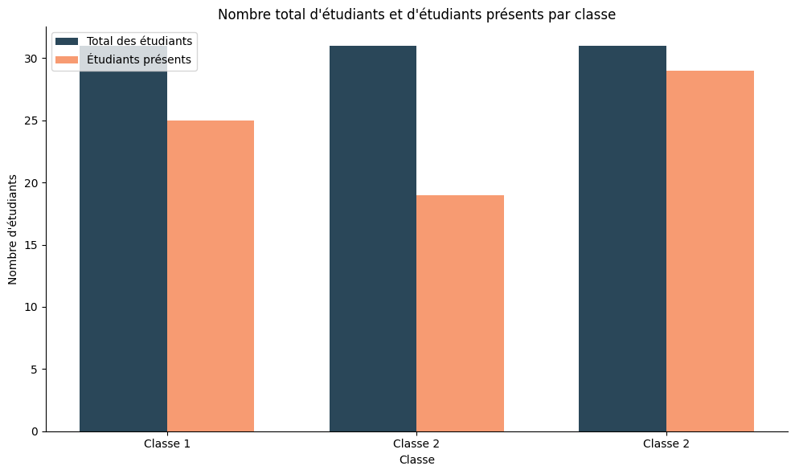
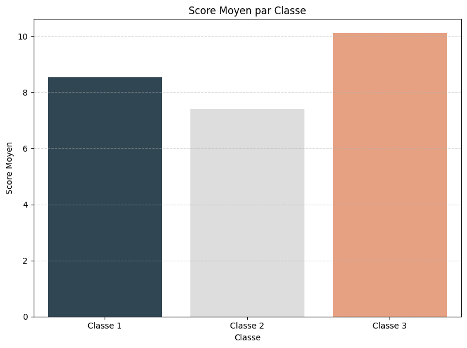

# 📊 Student Performance Analysis in Mathematics

Welcome! I'm a mathematics teacher with a passion for data analytics and educational insight. This project is a collection of analyses I’ve done on student performance, with the goal of improving teaching strategies and student outcomes.

## 📌 Project Goals

- Analyze students' performance based on classroom data.
- Identify trends, strengths, and areas for improvement.
- Visualize the data using charts and dashboards.
- Demonstrate skills in data cleaning, exploratory analysis, and reporting.

## 📈 Visual Examples
### 🧍‍♂️ Student Attendance Count by Class

### 📊 Average Score Comparison Across Classes

### 📉 Distribution of Student Scores

These visuals offer actionable insights for classroom-level decision-making.

## 🗂️ Structure

- `data/`: Raw and cleaned datasets.
- `notebooks/`: Jupyter notebooks for data exploration and visualization.
- `visuals/`: Graphs and figures generated from analysis.

## 🛠️ Tools Used

- Python (Pandas, NumPy, Matplotlib, Seaborn, Plotly)
- Jupyter Notebooks
- PDF reporting (e.g., Jupyter, Word or LaTeX)
- Git & GitHub

## 🙌 Contribute / Follow

This is an open toolkit for math teachers who want to bring data into their teaching practice. I’ll keep adding more tools—feel free to use them, give feedback, or suggest ideas!

📫 Feel free to contact me or follow for updates:

- [GitHub Profile](https://github.com/yourusername)  
- [LinkedIn](https://www.linkedin.com/in/anas-bellaouali)  
- ✉️ bellaoualai.anas@gmail.com  

---

